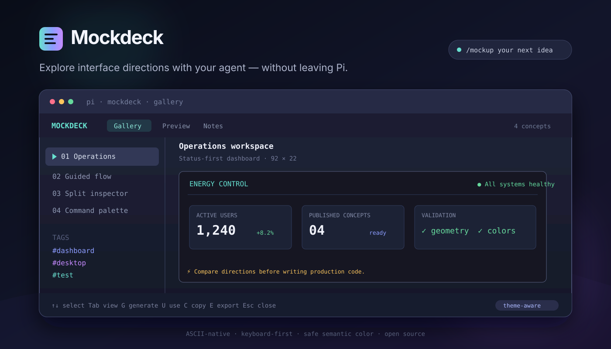

<p align="center">
  
</p>

<h1 align="center">Mockdeck</h1>

<p align="center">
  Explore interface directions with your coding agent, compare them in a fast terminal gallery, and carry the selected concept directly into implementation.
</p>

<p align="center">
  <strong>ASCII-native</strong> · <strong>keyboard-first</strong> · <strong>theme-aware</strong> · <strong>safe by design</strong>
</p>

## What is Mockdeck?

Mockdeck is a UI ideation extension and skill for [Pi](https://github.com/earendil-works/pi). It turns a short product brief into several structurally different ASCII interface concepts, then opens them in a responsive, colorized TUI gallery.

Instead of discussing layouts abstractly—or implementing the first idea too early—you can inspect multiple directions, read their trade-offs, export them, and place the chosen concept back into Pi's editor as an implementation prompt.

```text
brief → agent explores → concepts are validated → gallery → selection → implementation
```

Mockdeck is useful for:

- Dashboard and admin-panel exploration
- CLI and terminal application design
- Desktop, tablet, and mobile layout planning
- Comparing information hierarchies before coding
- Reviewing a proposed redesign with a team
- Giving an agent a concrete visual target

## How it works

Mockdeck combines two Pi resources:

1. **`ascii-ui-design` skill** — guides the agent to produce meaningful alternatives rather than cosmetic variations.
2. **Mockdeck extension** — validates, stores, colors, renders, browses, exports, and hands off those concepts.

The model never emits executable terminal styling. It publishes semantic color tags through the `mockdeck_publish` tool, and the extension maps those tags to the active Pi theme.

## Installation

### GitHub

```bash
pi install git:github.com/1y33/pi-mockdeck
```

### Local checkout

```bash
git clone https://github.com/1y33/pi-mockdeck.git
pi install /absolute/path/to/pi-mockdeck
```

To try the extension without installing it:

```bash
pi -e ./extensions/index.ts
```

## Quick start

Ask Mockdeck to explore a product idea:

```text
/mockup Design four alternatives for a supplier billing dashboard.
```

The agent creates distinct concepts and publishes each one. When generation finishes, the gallery opens automatically.

Open the gallery again at any time:

```text
/mockups
```

Select a concept and press <kbd>Enter</kbd> or <kbd>u</kbd>. Mockdeck places an implementation-ready prompt in Pi's editor; you remain in control of when coding begins.

## Commands

| Command | Purpose |
|---|---|
| `/mockup <brief>` | Generate several distinct interface concepts |
| `/mockups` | Open the saved-concept gallery |

The extension also exposes `mockdeck_publish` to the agent. You normally do not call this tool yourself.

## Gallery controls

| Key | Action |
|---|---|
| <kbd>↑</kbd>/<kbd>↓</kbd>, <kbd>j</kbd>/<kbd>k</kbd> | Select a concept |
| <kbd>←</kbd>/<kbd>→</kbd>, <kbd>h</kbd>/<kbd>l</kbd> | Collapse/expand folders or navigate to parent/child |
| <kbd>Tab</kbd> / <kbd>Shift</kbd>+<kbd>Tab</kbd> | Switch Gallery, Preview, and Notes |
| <kbd>1</kbd>–<kbd>9</kbd> | Jump to a visible tree row |
| <kbd>Enter</kbd> or <kbd>u</kbd> | Use the selected concept |
| <kbd>m</kbd> | Move selected mockup to a folder path (blank for root) |
| <kbd>g</kbd> | Generate related concepts |
| <kbd>c</kbd> | Copy plain ASCII to the clipboard |
| <kbd>e</kbd> | Export the concept as Markdown |
| <kbd>d</kbd> | Delete after confirmation |
| <kbd>Esc</kbd> or <kbd>q</kbd> | Close Mockdeck |

## Folder hierarchy

The gallery groups mockups into expandable nested folders. Press **M** on a mockup and enter a path such as `Dashboard/Mobile`; missing folders appear automatically. Leave the path blank to move it to the root. **Enter** toggles a selected folder; **←/→** collapse/expand it or navigate to its parent/child.

Agents can publish directly into a hierarchy with `folder: "Dashboard/Mobile"` in `mockdeck_publish`. Existing artifacts without a folder remain at the root. Folders are logical groups stored in artifact metadata, not filesystem directories; empty folders disappear when their last mockup is moved or deleted.

## Why ASCII?

ASCII mockups are lightweight design artifacts that both humans and agents can understand. They are fast to generate, easy to copy, diffable in Git, searchable, and independent of browser tooling.

Mockdeck supports Unicode box-drawing and block characters while retaining plain-text exports. Terminal cells—not pixels—remain the source medium.

## Color and geometry safety

Generated content cannot inject raw ANSI, OSC, C0, or other terminal control sequences. Mockdeck accepts only a restricted semantic vocabulary:

```text
[accent]Selected tab[/]  [success]● Healthy[/]  [warning]3 overdue[/]
```

Available tones:

`text` · `muted` · `dim` · `accent` · `success` · `warning` · `error` · `info`

Before publication, Mockdeck also validates:

- Canvas and viewport limits
- Balanced semantic color tags
- Consistent outer dimensions
- Connected vertical and nested box borders

Malformed new concepts are rejected with an exact row and column so the agent can correct them. Invalid legacy artifacts display a diagnostic rather than corrupting the gallery.

## Persistence and exports

By default, project artifacts live under:

```text
.pi/mockdeck/
├── index.json
├── artifacts/
│   └── <artifact-id>.json
└── exports/
    └── <concept-name>.md
```

Artifact JSON is the source of truth. Gallery output and Markdown exports are derived from it. Writes are atomic, and the index can be rebuilt from artifact files after corruption or interruption.

## Configuration

Global configuration: `~/.pi/agent/mockdeck.json`

Project configuration: `.pi/mockdeck.json`

Project values override global values:

```json
{
  "storageDir": ".pi/mockdeck",
  "autoOpenAfterGeneration": true,
  "solidBackground": true,
  "strictBoxGeometry": true,
  "defaultVariantCount": 4,
  "defaultViewport": { "width": 100, "height": 30 },
  "maxArtifacts": 500,
  "maxCanvasLines": 120,
  "maxLineWidth": 500
}
```

Relative storage paths resolve from the active project. Keep `solidBackground` enabled for readable galleries in transparent terminals such as Ghostty. Set `strictBoxGeometry` to `false` only when intentionally creating disconnected box-drawing art.

## Terminal support

Mockdeck uses Pi's TUI and works in ordinary modern terminals. Ghostty is an excellent fit thanks to truecolor, Unicode rendering, and Kitty keyboard protocol support, but no Ghostty-specific dependency is required.

Narrow terminals stack the folder tree above the selected preview. Use the Preview tab for a focused canvas.

## Project structure

```text
extensions/index.ts                 Pi commands, tool, and lifecycle wiring
skills/ascii-ui-design/SKILL.md    Agent design workflow
src/gallery.ts                     Keyboard-driven TUI
src/artifact.ts                    Validation and normalization
src/geometry.ts                    Box-topology validation
src/store.ts                       Atomic persistence and exports
```

## Development

Requirements: Node.js 22.19+ and Pi 0.85.1+.

```bash
npm install
npm run verify
npm pack --dry-run
```

The test suite covers semantic markup security, Unicode widths, box topology, responsive rendering, public extension registration, persistence, recovery, and exports.

## Contributing

Issues and pull requests are welcome. Please include a regression test for behavior changes and run `npm run verify` before submitting.

## Security

Pi packages run with the user's full system permissions. Review third-party extensions before installing them. Mockdeck never executes generated mockup content and writes only to its configured storage directory.

## License

[MIT](./LICENSE)
